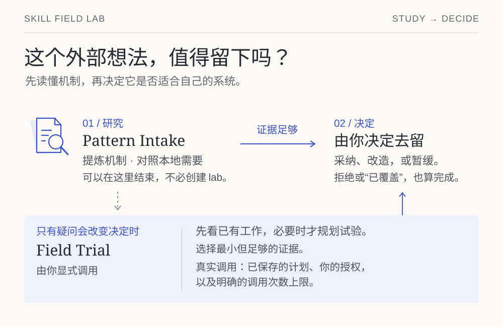

# Skill Field Lab

[English](README.md)

> **Study before you install. Test only what matters.**
>
> 先研究，再安装；只测试真正重要的东西。

Skill Field Lab 是一套 local maintainer workbench，只做一件事：研究一个外部
agent 机制，判断它是否该进入你自己的系统，然后只为这个决定真正需要的证据付成本。

它面向拥有 reusable agent behavior（Skill、prompt、harness、routing）的
maintainer，用来回答一类具体问题：*这个借来的机制该落在本地吗？*、
*我怎么知道这个 Skill 真的改变了结果？*、*有没有办法不用跑一整套 benchmark
就把它说清楚？* 一种风险是把每个看起来有意思的外部想法都塞进本地 runtime；
另一种风险是为一个本来靠读源码、一次 diff 或一个小 case 就能说清的 claim，
付出 target-model invocation。

Field Lab 一次只处理一个 claim，并优先尝试最小但足够的证据路径。专门设计的
synthetic trial 只是其中一种选择，不是默认动作。

当前版本 **0.2.1**，已完成 source 验证——schema v2 为 active，runtime 只用
Python 3.10+ 标准库，`codex-exec` 是唯一实现好的 adapter。这次验证覆盖什么、
不覆盖什么，见 [Current state](docs/CURRENT_STATE.md)、
[CHANGELOG.md](CHANGELOG.md) 与 [BUNDLE_REPORT.md](BUNDLE_REPORT.md)。

| 你想做什么 | 从哪里开始 |
| --- | --- |
| 理解产品与三个角色 | [常规路径](#常规路径) |
| 安装 app 与 controllers | [一次安装](#一次安装) |
| 为未决 claim 保存证据 | [建立一个 v2 lab](#建立一个-v2-lab) → [先看已有的工作](#先看已有的工作) |
| 判断 receipt 能证明什么 | [每条 lane 能证明什么，不能证明什么](#每条-lane-能证明什么不能证明什么) → [docs/EVIDENCE_MODEL.md](docs/EVIDENCE_MODEL.md) |
| 找到任意一份文档 | [docs/README.md](docs/README.md)（中英双语阅读地图） |

## 常规路径

[](docs/assets/decision-path.zh-CN.svg)

**Pattern Intake**（`$pattern-intake`）pin 一个外部 source，提炼一个可移植机制，
指出它对应哪个 local problem，选择最低的 landing plane，并以 `ADOPT`、`ADAPT`、
`REJECT`、`DEFER` 或 `ALREADY COVERED` 收尾。它不额外启动 target agent——不建
lab、不写 case、不写 subject；停在 `REJECT` 或 `DEFER` 同样是完整的结果，而不是
“研究失败”。

**Field Trial**（`$skill-eval`，只能显式调用）负责为一个 unresolved claim 选择
证据路径，顺序是：inspect source；observe 现有 ordinary work；跑单个 canary；
或跑 matched trial。它找的是**最小但足够的证据路径**，不是最彻底的路径，也不给
Skill 打全局分。

**`fieldlab`** 是需要结构化 lab records 时使用的 CLI evidence kernel。它通过
`observe` 绑定普通工作的 artifacts，将后续 `review` 独立保存，再由 `explain`
重新计算 claim 的证据。需要 synthetic trial 时，`plan` 先列明每次 invocation，
`run` 再在授权上限内执行。CLI 也管理 lab、验证、snapshot、迁移和选定 records 的
promotion。纯 source study 可以在不使用 CLI 的情况下结束。

## 一个小例子

以下例子用于说明流程，不代表一次真实运行记录。

你发现相邻 repo 里的 Skill 能把单文件改动保持得很直接，于是问：这个机制该不该
进入你自己的系统？Pattern Intake 会 pin 住 source、提炼机制，然后要么直接把问题
关掉——本地系统已经覆盖，或契合度不足——要么留下一个关于你自己 Skill 行为的
unresolved claim。接下来 Field Trial 先在这条 claim 上找你已经有的 ordinary work：
一次 diff、一条 trace、一个 test result、一份 review。如果这些证据足够，就用一次
`fieldlab observe` 把它记下来，再由你写下决策。只有当这条 claim 仍然 unresolved、
**而且**更强的证据会改变决策时，一次有边界的 trial 才值得它的 target-agent
invocation。处置由你写；Field Lab 只负责把推理与证据分开保存。

## 一次安装

在本仓库 checkout 中运行 installer。完整工作流需要 Python 3.10+、Git 和 Codex CLI。
v0.2 的 live execution 只支持 POSIX；
Windows 在有等价 process containment 之前 fail closed。

```bash
python3 scripts/install.py
~/.local/bin/fieldlab doctor
```

Transactional installer 会安装：

- app：`~/.local/share/skill-field-lab`；
- launcher：`~/.local/bin/fieldlab`；
- 两个 controller Skills：`${CODEX_HOME:-~/.codex}/skills`；
- app 内的 installation receipt。

它拒绝覆盖陌生 target。确认升级时使用 `--replace`：旧 app、launcher 和
controllers 会先复制进 recoverable backup；`--cli-only` 则完全不碰 Skill
discovery path。自定义路径、rollback 与 uninstall 见
[安装与恢复](docs/INSTALLATION.md)。

## 建立一个 v2 lab

```bash
fieldlab init /path/to/my-study --lab-id my-study
fieldlab validate /path/to/my-study/fieldlab.json
fieldlab list /path/to/my-study/fieldlab.json
```

`init` 会创建一个 isolated control 和空的 records/cases 目录。`list` 和
`validate` 检查 lab；`selftest` 在一次性副本中运行声明的 deterministic checks，
不调用 target agent。`snapshot-git` 把本地 Git ref/path 固定成 lab-owned snapshot；
`promote` 将选定 records 复制进指定的 subject evidence 目录。
在 `fieldlab.json` 中加入显式 local source：

```json
{
  "schema_version": 2,
  "lab_id": "my-study",
  "description": "Test one unresolved reusable-agent behavior claim.",
  "subjects": {
    "isolated-control": {"kind": "control"},
    "my-skill": {
      "kind": "agent-skill",
      "source": {"type": "local-path", "path": "/path/to/subject/skills/my-skill"}
    }
  },
  "cases_root": "cases",
  "defaults": {
    "adapter": "codex-exec",
    "approval_policy": "never",
    "network_access": false,
    "output_root": "runs",
    "keep_workspace": false
  }
}
```

支持 `local-path`、`local-git-ref`、lab-owned `snapshot` 和 `control`。
Field Lab 不自动 clone URL、不解析 marketplace，也不猜 installed Skills。

Case 可以检查 final agent response、workspace files、bounded commands、raw
trace properties 或明确列出的 human-review needs。`fixture/` 和 `expected/`
都是 optional；有 `expected/` oracle 时，下面的 no-spend gate 会证明 unresolved
fixture 至少失败一项，而 expected overlay 全部通过：

```bash
fieldlab selftest /path/to/my-study/fieldlab.json
```

Selftest 报告 `deterministic_oracle_status`、已覆盖／未覆盖的检查面和零 target
invocations。它只执行 workspace/command assertions，不验证 result、trace 或
human review；`oracle_status` 是兼容 alias。Output-only case 在这里报告
`not-applicable`，所以下面的 legal-research example 不会仅凭 selftest 就证明
final-response 行为。

Repo 自带两个 v2 labs：一个 file-edit oracle；一个完全不改文件、只验证 final
response 的 legal-research case：

```bash
fieldlab validate examples/demo/fieldlab.json
fieldlab selftest examples/demo/fieldlab.json
fieldlab validate examples/legal-research/fieldlab.json
fieldlab selftest examples/legal-research/fieldlab.json
```

## 先看已有的工作

Ordinary trace、diff、test result 或 review 可以直接绑定 claim，不必先造 synthetic
case：

```bash
fieldlab observe /path/to/my-study/fieldlab.json \
  --subject my-skill \
  --claim one-bounded-claim \
  --outcome supported \
  --artifact review=/path/to/review.md \
  --note "这份 artifact 证明什么，以及证明不到哪里。"
```

Observed receipt 是 content-light 的，且不会启动 target agent。后续 human
review 另存为独立 record，并绑定 immutable receipt digest。

创建该 review 时，JSON object 的 keys 必须与 receipt 中声明的
human-review requirements 完全一致。只有 receipt 没有声明任何
requirements 时才可以省略 `--requirement-outcomes`：

```bash
fieldlab review /path/to/my-study/fieldlab.json \
  --review-id one-bounded-review \
  --receipt /path/to/my-study/runs/one-attempt/receipt.json \
  --independence separate-agent \
  --judgment supported \
  --rationale "这份 review 支持什么，以及哪些仍未验证。" \
  --requirement-outcomes /path/to/requirement-outcomes.json
```

每个 value 只能是 `supported`、`not-supported` 或 `inconclusive`。
Missing、extra、duplicate、malformed、symlinked 或超过大小限制的
outcome input 都会 fail closed。Review command 不启动 target agent，也不修改
receipt。

## 先 explain claim，再决定是否相信它

`fieldlab explain` 是 read-only 的。它从 claims、immutable receipts 和独立
reviews 重新计算一个 claim 的 evidence view，不会直接相信手写的
`claim.status`，也不会把 `PASS` 当作结论：

```bash
fieldlab explain /path/to/my-study/fieldlab.json --claim one-bounded-claim
```

报告会把 `supported`、`unsupported`、`inconclusive` 分开，并在 bound reviews
彼此冲突时给出 `mixed`；在 receipt 有记录时显示 subject identity、sealed
worker-final output、verifier attribution、declared review material 与
retention。同一个 receipt 被复制到多个 canonical location 时会按 digest
deduplicate；缺少 worker-final boundary marker 的 legacy receipt 会标记为
`legacy-ambiguous`。报告还列出 pending、failed 或 conflicting 的 review
requirements，以及 missing 或 digest-drifted 的 artifacts，并给出最小的 next
evidence gap。`--json` 输出同样的结构，方便工具消费。它不额外启动 target
agent，也不修改 lab 或 subject。

## 先 plan，再花任何钱

Plan 对 subject 是 read-only，也不会额外启动 target agent：

```bash
fieldlab plan /path/to/my-study/fieldlab.json \
  --subject isolated-control \
  --subject my-skill \
  --case one-case \
  --mode matched \
  --repeat 1 \
  --model gpt-5.6-sol \
  --reasoning-effort high \
  --output /path/to/my-study/plans/one-plan.json
```

Plan 会列出每一次 invocation，并 pin manifest、prompt、case、fixture、subject
source、Field Lab source 与当前可解析的 Codex executable。任何 input 变化都
fail closed。Plan 本身不授权 execution。

Live run 必须同时具备三道 gate：

```bash
fieldlab run /path/to/my-study/plans/one-plan.json \
  --live \
  --max-invocations 2
```

没有 implicit retry、grader、repeat、baseline 或 full suite。Target 与 verifier
各自在 dedicated POSIX process group 中运行；只有 group quiescent 后才 seal evidence。

每次 attempt 在调用前都会重新核对实际 subject mount 与 saved plan 是否一致，Git
subject 只使用计划中已解析的 commit。交付不一致时以 `input-drift` 停止后续 matrix，
该 attempt 的 target calls 为零；materialization 错误归入 `preflight-failed`。
这类 failure receipt 只 seal preflight artifacts，不声称 worker-final 或
process-quiescence。

Runner 还会在任何 verifier process 启动之前，先 seal worker-final 的
changed-file set、diff 与 tree digest。Workspace assertions 读取这些 sealed
worker bytes；每条 command assertion 都从同一棵 sealed tree 的**独立** byte copy
开始，因此不会继承其他 command 的修改。copy 内的改动会被 attribution 为
verifier-derived，不能把 worker 结果变成干净的 `pass`，copy 在 attempt 结束后删除。
seal diff 使用 disposable Git index copy，因此不会改动 workspace 自身的 index bytes
与 cached diff。这是 protected-source/derived-output contract，不是对 OS-level
containment 的声明。

Live worker workspace 不再默认保留。Case 声明了 human-review requirements 时，可以
再声明 `human_review_material`：pending review 真正需要的、精确的 workspace-relative
文件路径。Glob、目录、symlink、逃逸路径、缺失文件或超限集合都会被拒绝。Declared
files 在任何 verifier 运行之前被原子复制到 attempt 自己的 `review-material/`，并附带
记录精确 path、digest、byte size 与固定 limits 的 manifest；manifest digest 与 status
绑定进 `verification.json` 和 immutable receipt。capture 失败属于 evidence-sealing
error：不会留下 partial material set，也不会产生正常 receipt，并会记录为独立的
`evidence-failed` attempt/run state（而不是 `termination-failed`）。只有 review
requirements、没有 declared material 的 case 依赖标准 attempt artifacts
（`case.json`、`prompt.md`、`trace.jsonl`、`stderr.log`、`final-output.md`、
`diff.patch`、`verification.json`）。`keep_workspace=true` 仍然是唯一保留整个
workspace 的开关。

## 每条 lane 能证明什么，不能证明什么

Receipt 把这些维度分开，而不是压成一个总分：

- origin：`observed | synthetic`；
- subject scope：`isolated-control | workspace-scoped | hermetic`；
- comparison：`unmatched | single | matched`；
- verification methods：`deterministic | human | llm`；以及
- independence：`implementer-run | separate-agent | external-reviewer`。

`hermetic` 仍然 reserved；workspace-scoped evidence 不能证明 exclusive causation。
Requested model / effort 只是 caller-selection evidence，除非 provider 暴露更强的
runtime identity。一次 live run 还同时区分三层交付：已验证的 subject mount
（`subject_delivery`）、host selection（当前 adapter 下为 unknown），以及 content
application 是否真的发生（需要 semantic review）。`activation` 只是声明的场景，
不证明宿主真的激活了 Skill：trace `command_reference_mentions` 及其
`command_reference_mentions_include` assertion 只证明 command-path mention——
`echo references/example.md` 也算，即使从未读取该文件。`reference_reads_include`
仍是保留的 deprecated v2 assertion alias。

## V1 只是一条 migration input

设计 v0.2 时，v0.1 尚无外部用户，因此 v0.2 没有 dual runtime，也不保留旧 command
aliases。Normal commands 只接受 schema-v2 `fieldlab.json`。已有 v1 pack 可一次性迁移：

```bash
fieldlab migrate-v1 /path/to/fieldlab-pack.json \
  --output /path/to/new-external-lab/fieldlab.json
```

Migrator 不改 source pack；它把 cases 真正改写成 schema v2，把 legacy overlays
snapshot 进新 lab，并在 receipt 中记录任何 semantic change。

## 从哪里读起

| Path | 是什么 |
| --- | --- |
| [`docs/README.md`](docs/README.md) | 中英双语的阅读地图：哪个问题由哪份文档回答 |
| [`docs/PRODUCT_SPEC_V0.2.md`](docs/PRODUCT_SPEC_V0.2.md) | 已接受的 product / acceptance contract |
| [`docs/EVIDENCE_MODEL.md`](docs/EVIDENCE_MODEL.md) | claim ceiling、evidence 维度、receipt/review 解读 |
| [`docs/CURRENT_STATE.md`](docs/CURRENT_STATE.md) | 当前已验证的内容，各 proof layer 分开陈述 |
| `schemas/v2/` | active JSON Schemas（`schemas/v1/` 只用于理解 migration input） |
| `examples/` | self-contained v2 labs |
| `case-studies/` | 独立 subject 的 integration note 与 screened receipt；不是 subject source |

workspace、architecture、adapter、installation 与历史文档都在
[docs/README.md](docs/README.md) 这份共享阅读地图里。

Softpowers 与 Repository Operational Truth Audit 都保持独立。它们自己的 repo
拥有 Skill 和 cases；Field Lab 只保存 integration note 与有边界的 evidence。
`promote` 仍然是 Field Lab 唯一会主动把选定 records 复制进某个 subject evidence
directory 的操作。

带日期的 v0.2.0 canary（对 Repository Operational Truth Audit snapshot 的一次显式
`source-artifact-split` run：一次 target invocation、零 grader、无 retry）及其
claim ceiling 写在 [bundle report](BUNDLE_REPORT.md) 与经过筛选的
[case study](case-studies/repository-operational-truth-audit.md) 里，不在这里。
它不证明 provider-resolved model identity、exclusive causality、subject 的
installed / activated behavior、任意 repo、owner acceptance、comparison
superiority 或 longitudinal reliability。

## 开发验证

```bash
python3 -m unittest discover -s tests -p 'test*.py'
python3 scripts/check_bundle.py
skill-validate skills/pattern-intake
skill-validate skills/skill-eval
git diff --check
```

Runner regression 使用 fake adapters；普通 repo test 不会启动 target model。

## Licensing

Project-original functional materials 使用 SUL-1.0；project-original standalone
documentation 使用 CC BY-NC-SA 4.0。精确 path map 见 [LICENSING.md](LICENSING.md)。
第三方与独立 subject material 继续受它自己的条款约束。
