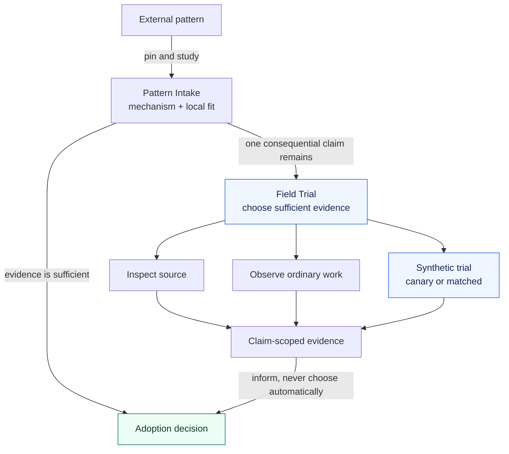
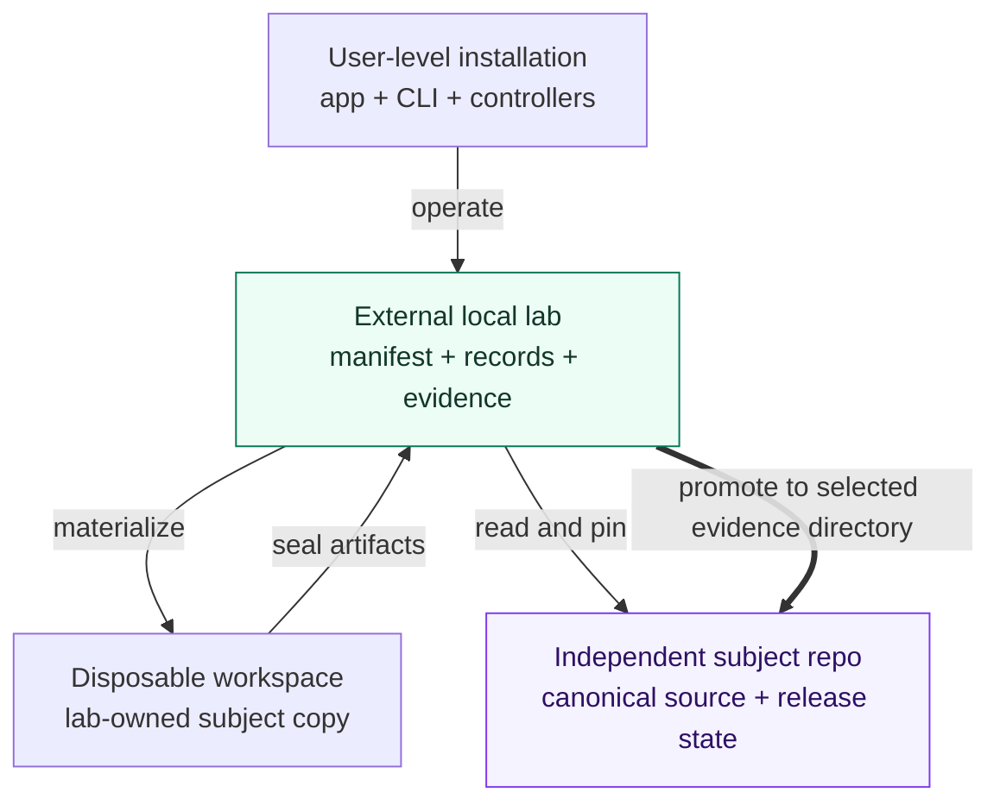
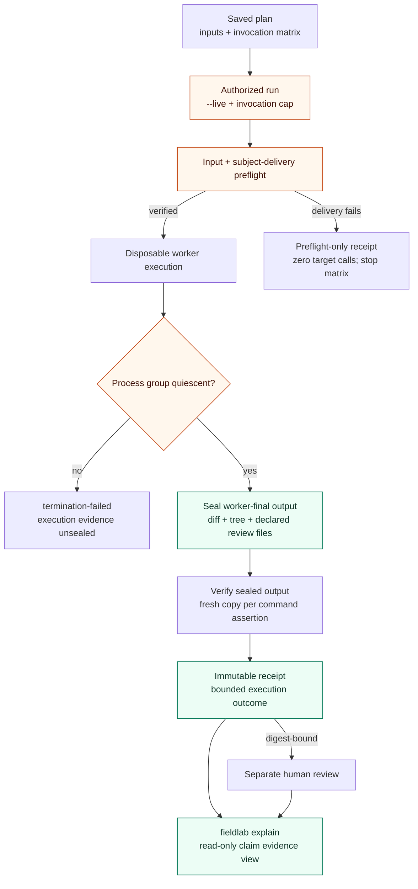

# Architecture

[简体中文](ARCHITECTURE.zh-CN.md) · [Documentation map](README.md)

This is an explanatory map of the current source. The [Product spec](PRODUCT_SPEC_V0.2.md)
owns product behavior; the [Workspace model](WORKSPACE_MODEL_V0.2.md) owns
subject identity and materialization; the [Evidence model](EVIDENCE_MODEL.md)
owns evidence interpretation. Dated release and verification status lives in
[Current state](CURRENT_STATE.md).

Skill Field Lab connects three jobs: study a reusable mechanism, decide whether
more evidence is needed, and preserve exactly what that evidence supports.
The diagrams below separate those jobs from file ownership and execution.
Boxes are responsibilities or local artifacts, not independent services.
There is no daemon, global registry or subject runtime dependency.

## 1. From an external pattern to a decision

**Question:** what must happen before a useful-looking idea belongs in a local system?

Pattern Intake can close with `ADOPT`, `ADAPT`, `REJECT`, `DEFER`, or
`ALREADY COVERED` before a lab exists. A decision records the rationale,
accepted mechanism, excluded machinery and condition for reopening it;
adoption still needs its own implementation or installation authority.

Field Trial is the explicit-only `skill-eval` controller. Its lanes are choices,
not a mandatory sequence: start with inspection and ordinary traces, diffs,
tests or reviews. A canary or matched comparison is justified only by an
unresolved claim that matters to the decision. There is no global Skill score
or automatic winner. The `fieldlab` CLI records and executes the selected
evidence path; it does not choose the final disposition.

For example, studying a reference-reading rule may establish that the local
Skill already covers it. That can end as `ALREADY COVERED`, with no installation
or additional target-agent invocation. If whether the rule changes behavior remains material, ordinary
work may answer it; only the remaining gap motivates a trial. This example is
illustrative, not a reported experiment.

## 2. Ownership and the subject-write boundary

**Question:** where do source, mutable execution and durable evidence belong?

- **Level 0:** source study needs no lab. **Level 1:** a visible external lab
  owns the manifest, records, plans and attempt artifacts; reading and
  materialization leave the subject source unchanged. The workspace receives
  a copy, not ownership of the original source.
- **Level 2:** the thick `promote` edge is the only Field Lab operation that
  intentionally writes to a selected subject evidence directory. It copies
  selected candidates, claims, cases, receipts, reviews and decisions, refuses
  collisions, and never copies runtime, manifest, plans or mutable runs.
  It neither commits nor pushes.
- `fieldlab/` and the controller Skills in this repository are canonical source.
  Installation is a derived copy managed by the transactional
  [`scripts/install.py`](../scripts/install.py). Installed bytes, controller
  discovery and live behavior are separate observations; see [Installation](INSTALLATION.md).

Local source types and symlink/drift rules belong to the
[Workspace model](WORKSPACE_MODEL_V0.2.md). V1 input goes through
[one-shot migration](MIGRATION_V1_TO_V2.md), never a parallel runtime.

## 3. A synthetic attempt and its evidence

**Question:** how can a later check or judgment avoid changing what the worker actually did?

Planning starts no target model. A live run rechecks pinned inputs; every
attempt additionally compares the actual subject mount with the plan. Git
subjects use the planned commit. Delivery mismatch (`input-drift`) or setup
failure (`preflight-failed`) stops the remaining matrix before invocation.
Those receipts establish only preflight facts, with no worker-final or process
claim. Earlier input drift rejects the saved plan outright.

The worker receives the ordinary prompt, fixture, subject copy and permitted
tools. Controller instructions, hidden assertions, expected outputs and review
rubrics remain outside that context. The sole implemented adapter is
`codex-exec`; it uses isolated worker HOME and ignored user config while keeping
the operator's selected Codex authentication directory. This is workspace-scoped
evidence, not hermetic isolation. Live execution is POSIX-only.

After target quiescence, worker output is sealed **before** verifier commands.
Workspace assertions read those worker bytes; each command starts from its own
copy of the same tree. A verifier's repair is attributed separately and cannot
make the worker result a clean pass. Target and command-verifier process groups
must become quiescent; timeout, surviving descendants and cleanup failures
cannot yield normal success. Declared review-file capture failure records
`evidence-failed` and produces no normal receipt. See the [Adapter contract](ADAPTER_CONTRACT.md)
and [Workspace model](WORKSPACE_MODEL_V0.2.md) for the full failure/retention rules.

The live workspace is removed unless `keep_workspace` was selected. Sealed
artifacts and any bounded declared review files remain in the lab. Human review
is a separate record bound to the receipt digest; it never edits the receipt.
`explain` recomputes one claim's evidence, including conflicting reviews and
missing artifacts. A receipt can fail or remain inconclusive; a `PASS` alone
is not an adoption decision. Verified delivery does not prove host selection,
content application or exclusive causation.

## Find the implementation

| Responsibility | Canonical source | Contract |
| --- | --- | --- |
| Study and lane selection | [pattern-intake](../skills/pattern-intake/SKILL.md), [skill-eval](../skills/skill-eval/SKILL.md) | [Product spec](PRODUCT_SPEC_V0.2.md) |
| Plan, materialize and execute | [plan.py](../fieldlab/plan.py), [subjects.py](../fieldlab/subjects.py), [runner.py](../fieldlab/runner.py), [process.py](../fieldlab/process.py) | [Workspace model](WORKSPACE_MODEL_V0.2.md), [Adapter contract](ADAPTER_CONTRACT.md) |
| Verify, seal and interpret | [verify.py](../fieldlab/verify.py), [receipts.py](../fieldlab/receipts.py), [review_material.py](../fieldlab/review_material.py), [explain.py](../fieldlab/explain.py) | [Evidence model](EVIDENCE_MODEL.md) |
| Install and check derived bytes | [install.py](../scripts/install.py), [doctor.py](../fieldlab/doctor.py) | [Installation](INSTALLATION.md) |
