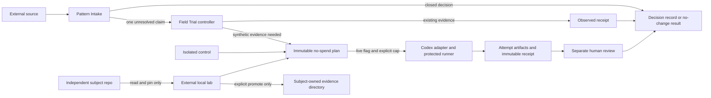

# Architecture

Status: current v0.2 source contract.

Skill Field Lab is one installed maintainer workbench around independently
owned local subjects. It has no daemon, registry, background scheduler, or
subject runtime dependency.



## Controller plane

`pattern-intake` studies one mechanism and may finish with `ADOPT`, `ADAPT`,
`REJECT`, `DEFER`, or `ALREADY COVERED` without creating a lab. It is allowed
to invoke implicitly because it starts no target model and grants no write or
installation authority.

`skill-eval`, displayed as **Field Trial**, is explicit-only. It receives one
unresolved claim, looks for existing ordinary-work evidence first, then designs
the weakest sufficient synthetic path only if the decision still needs it.
Controller instructions, hidden assertions, expected artifacts, and evaluator
advice never enter the target-worker prompt.

## Workspace plane

`fieldlab.json` owns one inspectable lab. The active loader accepts schema v2
only. A lab can point to:

- an external `local-path`;
- one `local-git-ref` plus repository-relative subpath;
- a lab-owned immutable `snapshot`; or
- an `isolated-control` with no subject overlay.

All execution happens in disposable Git workspaces. Fixture and source
symlinks are checked before copy. Local paths and Git refs are content-pinned
into the plan; drift before execution rejects the plan. Level 1 operations do
not write to the subject repository.

## Execution plane

The adapter registry currently exposes one real adapter: `codex-exec`.
Provider independence is not claimed. The adapter:

- passes only the ordinary case prompt and disposable workspace to the worker;
- ignores user config and isolates worker `HOME` while retaining the operator's
  Codex authentication directory;
- uses the declared sandbox, approval, network, requested model, and requested
  reasoning effort; and
- streams raw JSONL trace and stderr into the attempt directory.

The runner preserves the v0.1 execution kernel:

1. `plan` starts no target model and enumerates every invocation.
2. `run` requires a saved plan, `--live`, and `--max-invocations`.
3. Manifest, case, prompt, fixture, subject, Field Lab source, and available
   executable identity are re-pinned immediately before execution.
4. Target and command-verifier processes use dedicated POSIX process groups.
5. Timeout, interrupt, parent-exit-with-child, and cleanup failure all converge
   on bounded group termination.
6. Evidence seals only after group quiescence. A termination failure cannot be
   represented as a normal pass.

Windows live execution remains unsupported because v0.2 has no equivalent Job
Object containment adapter.

## Evidence plane

The record chain is:

```text
source -> candidate -> claim -> [case -> plan -> attempt -> receipt] -> decision
```

The bracketed synthetic chain is optional. `observe` may bind an existing
artifact directly to a claim. Candidate describes a mechanism and local fit;
Decision alone owns the final disposition. A sealed receipt is immutable;
later human judgment lives in a separate review record bound to its digest.

Raw attempt artifacts stay in the lab. Receipts are content-light digests and
bounded summaries. `promote` copies only selected candidates, claims, cases,
receipts, reviews, and decisions. It never promotes the runtime, lab manifest,
plans, or run workspaces.

## Installation plane

`scripts/install.py` stages the app, launcher, and controllers before any
replacement. It recognises only its own marker, launcher, current controller
digests, or the two known v0.1 controller digests. Existing targets are copied
to a recoverable backup; adjacent rollback identities remain available until
the entire replacement commits. A mid-commit failure restores prior targets.

The installed app carries source controller copies so `fieldlab doctor` can
compare installed discovery bytes with the installation source. Installed
bytes still do not prove next-turn Skill discovery or any target behavior.

## Legacy boundary

V1 is not an alternate architecture. `migrate-v1` is an offline parser that
creates a separate v2 lab, rewrites legacy cases, snapshots overlay sources,
and records semantic changes. Every normal command thereafter uses the single
v2 object and execution model.
