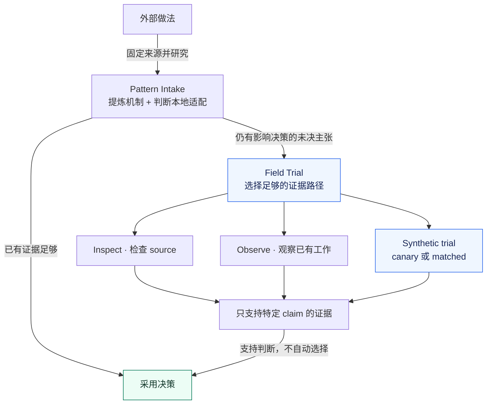
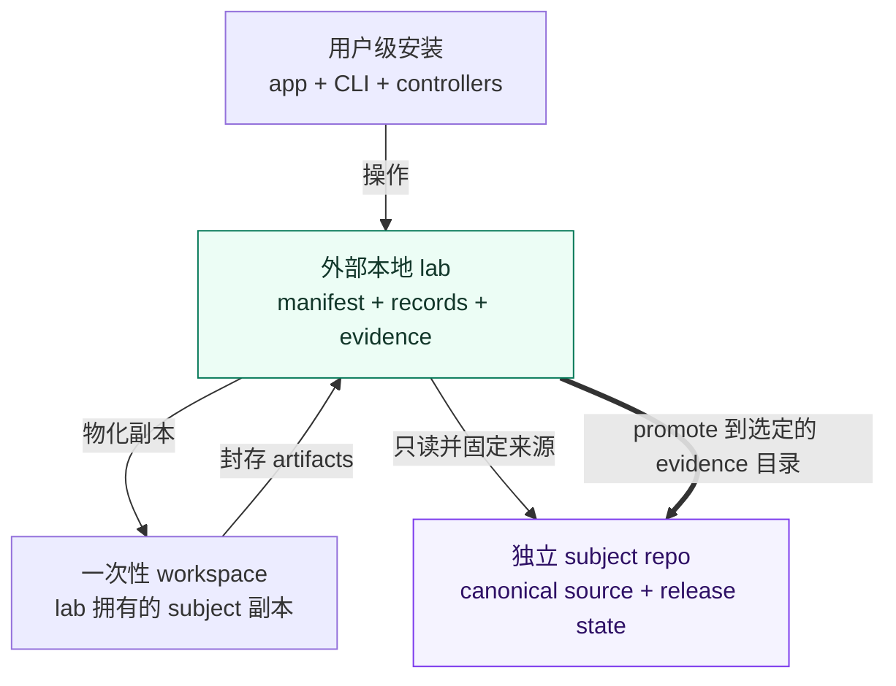
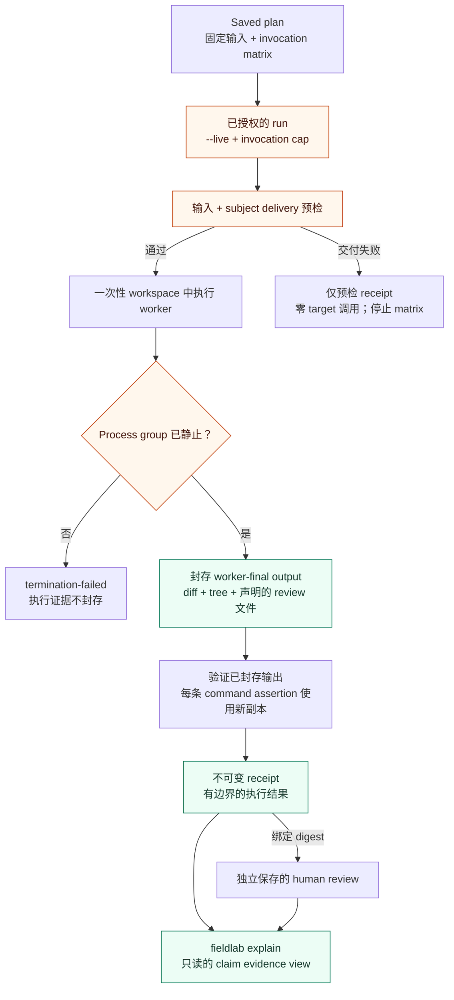

# 架构

[English](ARCHITECTURE.md) · [文档地图](README.md)

本文是当前 source 的解释性地图。[Product spec](PRODUCT_SPEC_V0.2.md) 管理产品行为，
[Workspace model](WORKSPACE_MODEL_V0.2.md) 管理 subject identity 与 materialization，
[Evidence model](EVIDENCE_MODEL.md) 管理证据解释。有日期的版本与验证状态见
[Current state](CURRENT_STATE.md)。

Skill Field Lab 把三件事连起来：研究一个可复用机制，判断是否还需要证据，保留证据
实际能支持的结论。下面三张图分别解释决策过程、文件所有权和执行过程。
图中的方框是职责或本地 artifact，不是独立服务；系统没有 daemon、global registry，
也不会成为 subject 的 runtime dependency。

## 1. 从外部做法到采用决策

**这张图回答：** 一个看起来有用的做法，怎样才有理由进入本地系统？

Pattern Intake 可以在 lab 出现之前，以 `ADOPT`、`ADAPT`、`REJECT`、`DEFER`
或 `ALREADY COVERED` 收口。Decision 记录理由、接受的机制、排除的配套机制，以及
什么情况会重新开启判断；真正的实施或安装仍需对应授权。

Field Trial 是只能显式调用的 `skill-eval` controller。图中的分支是可选择的路径，
不是每次都要走完的流程：先看 source，再看普通工作已有的 trace、diff、test 或 review。
只有一个影响决策的 claim 仍然悬而未决，才有理由进行 canary 或 matched comparison。
这里没有通用 Skill 总分或自动胜者。`fieldlab` CLI 负责记录和执行所选证据路径，
最终采用决策由维护者作出。

例如，研究一条 reference-reading 规则后，可能发现本地 Skill 早已覆盖，于是直接以
`ALREADY COVERED` 结束，不安装、不额外启动 target agent。如果“这条规则是否改变行为”仍影响
采用决定，可以先看已有工作；只有剩下的证据缺口才需要 trial。这个例子用于解释流程，
不代表一次已执行的实验。

## 2. 所有权与 subject 写入边界

**这张图回答：** source、可变执行现场和持久证据分别归谁？

- **Level 0：** source study 无须 lab。**Level 1：** 可见的外部 lab 拥有 manifest、
  records、plans 和 attempt artifacts；读取与物化不改动 subject source。
  Workspace 得到的是副本，原始 source 的所有权没有转移。
- **Level 2：** 加粗的 `promote` 是 Field Lab 唯一有意写入指定 subject evidence
  目录的操作。它只复制选定的 candidates、claims、cases、receipts、reviews 和
  decisions，拒绝覆盖冲突；runtime、manifest、plans 和可变 runs 不会被复制。
  它不执行 commit 或 push。
- 本仓库的 `fieldlab/` 与 controller Skills 是 canonical source。安装结果是由
  事务式 [`scripts/install.py`](../scripts/install.py) 管理的派生副本。
  Installed bytes、controller discovery 和 live behavior 是不同的观察层；
  具体操作见 [Installation](INSTALLATION.md)。

本地 source 类型、symlink 与 drift 规则由 [Workspace model](WORKSPACE_MODEL_V0.2.md)
定义。V1 只经过[一次性迁移](MIGRATION_V1_TO_V2.md)，不构成并行 runtime。

## 3. Synthetic attempt 与证据封存

**这张图回答：** 如何让后来的检查或判断不改变 worker 实际做过什么？

Plan 不启动 target model。Live run 重新核对固定输入；每个 attempt 还会比较实际
subject mount 与计划中的 identity。Git subject 使用计划中的 commit。交付不一致
（`input-drift`）或 setup 失败（`preflight-failed`）会在调用前停止剩余 matrix。
这类 receipt 只证明 preflight 事实，不声称存在 worker-final 或 process 证据。
更早的输入 drift 则会直接拒绝 saved plan。

Worker 收到普通 prompt、fixture、subject 副本和获准使用的 tools。Controller
instructions、hidden assertions、expected outputs 和 review rubrics 留在该 context
之外。唯一实现的 adapter 是 `codex-exec`：它隔离 worker HOME、忽略 user config，
同时使用操作者选择的 Codex authentication directory。这支持 workspace-scoped evidence，
不构成 hermetic isolation；live execution 仅支持 POSIX。

Target process group 静止后，worker output 在 verifier commands **之前**封存。
Workspace assertions 读取 worker bytes；每条 command 从同一棵 tree 的独立副本开始。
Verifier 做出的修补单独归属，不能让 worker result 变成 clean pass。Target 和
command-verifier process groups 都必须静止；timeout、存活的后代与 cleanup failure
不能产生正常成功结果。声明的 review 文件捕获失败会记录 `evidence-failed`，
不产生正常 receipt。完整失败与保留规则见 [Adapter contract](ADAPTER_CONTRACT.md)
和 [Workspace model](WORKSPACE_MODEL_V0.2.md)。

除非选择了 `keep_workspace`，否则 live workspace 会被移除；已封存 artifacts 与
有界的 review 文件留在 lab。Human review 是绑定 receipt digest 的独立 record，
不会改写 receipt。`explain` 重新计算一个 claim 的证据，并显示冲突 review 和缺失
artifact。Receipt 可以失败或无法得出结论；单次 `PASS` 不等于采用决策。
Verified delivery 也不证明 host selection、content application 或 exclusive causation。

## 去哪里看实现

| 职责 | Canonical source | 合同 |
| --- | --- | --- |
| 研究与证据路径选择 | [pattern-intake](../skills/pattern-intake/SKILL.md)、[skill-eval](../skills/skill-eval/SKILL.md) | [Product spec](PRODUCT_SPEC_V0.2.md) |
| Plan、物化与执行 | [plan.py](../fieldlab/plan.py)、[subjects.py](../fieldlab/subjects.py)、[runner.py](../fieldlab/runner.py)、[process.py](../fieldlab/process.py) | [Workspace model](WORKSPACE_MODEL_V0.2.md)、[Adapter contract](ADAPTER_CONTRACT.md) |
| 验证、封存与解释 | [verify.py](../fieldlab/verify.py)、[receipts.py](../fieldlab/receipts.py)、[review_material.py](../fieldlab/review_material.py)、[explain.py](../fieldlab/explain.py) | [Evidence model](EVIDENCE_MODEL.md) |
| 安装与核对派生副本 | [install.py](../scripts/install.py)、[doctor.py](../fieldlab/doctor.py) | [Installation](INSTALLATION.md) |
