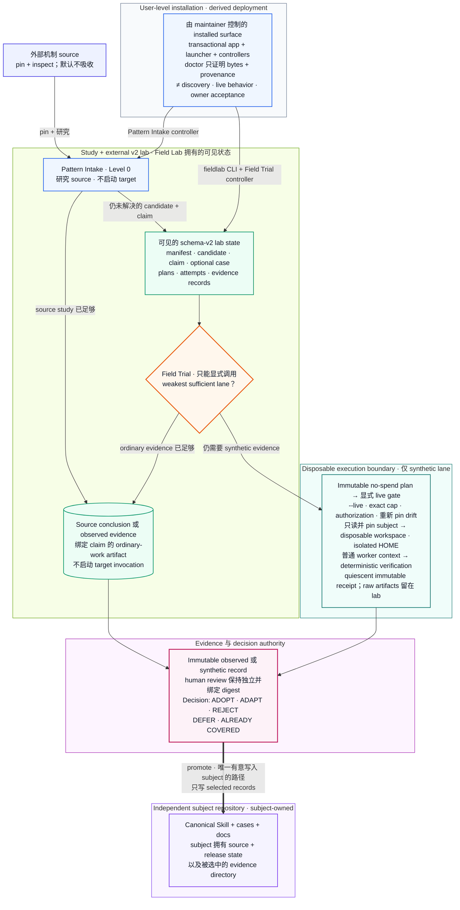

# 架构

[English](ARCHITECTURE.md)

状态：当前 v0.2 source contract。

这张图回答一个核心问题：Skill Field Lab 如何把一次 source study 变成有明确
claim ceiling 的 evidence，同时不隐藏 model spend，也不夺走 subject repo 的
ownership？

图里的 boxes 是 logical responsibilities，不是各自独立部署的 services。Skill
Field Lab 没有 daemon、global registry、background scheduler，也不是 subject
的 runtime dependency。

## 系统总览



## 怎么读这张图

1. **Study 可以在 lab 出现前结束。** Pattern Intake 可能仅凭 source evidence
   就回答问题，以 decision 或 no-change result 收口，不启动 target invocation。
2. **Lab 拥有 evidence state，不拥有 subject source。** `fieldlab.json`、cases、
   plans、attempts、receipts、reviews 与 decisions 都留在可见的 external v2
   lab。
3. **Planning 与 execution 是两道 gate。** Plan 不启动 target model；synthetic
   execution 还必须同时拥有 saved plan、`--live`、exact invocation cap 与
   maintainer 的另行授权。
4. **Evaluator-only material 不进入 worker context。** Target 只收到普通 case
   prompt 与 disposable workspace；hidden assertions、expected artifacts 与
   review rubric 始终留在 controller side。
5. **Receipt 不吞并后来的 judgment。** Process group quiescent 后 attempt
   evidence 才会 seal；human review 是另一份绑定 digest 的 record；只有
   Decision 拥有 final disposition。
6. **Subject source 以只读方式进入 execution。** Synthetic-lane node 明确写出
   pin-and-materialize boundary。加粗的 `promote` edge 是唯一有意写入 subject
   的路径，并且只携带 selected records；runtime、manifest、plans 与 run
   workspaces 永远不会被 promote。

## Controller plane

`pattern-intake` 研究一个 mechanism，可以在不创建 lab 的情况下以 `ADOPT`、
`ADAPT`、`REJECT`、`DEFER` 或 `ALREADY COVERED` 收口。它允许 implicit invoke，
因为它不启动 target model，也不授予 write 或 installation authority。

`skill-eval` 的 display name 是 **Field Trial**，并且只能 explicit invoke。它
接收一个 unresolved claim，先寻找 existing ordinary-work evidence；只有当决策
仍需要更强 evidence 时，才设计 weakest sufficient synthetic path。Controller
instructions、hidden assertions、expected artifacts 与 evaluator advice 都不会
进入 target-worker prompt。

## Workspace plane

`fieldlab.json` 拥有一份 inspectable lab。Active loader 只接受 schema v2。Lab
可以指向：

- external `local-path`；
- 一个 `local-git-ref` 与 repo-relative subpath；
- lab-owned immutable `snapshot`；或
- 不带 subject overlay 的 `isolated-control`。

所有 synthetic execution 都发生在 disposable Git workspaces 中。Fixture 与
source symlinks 会在复制前检查；local paths 与 Git refs 在 plan 中做 content
pinning；execution 前发生任何 drift，plan 都会被拒绝。Level 1 operations 不会
写入 subject repo。

## Execution plane

Adapter registry 当前只有一个 real adapter：`codex-exec`，并不声称 provider
independence。它会：

- 只把普通 case prompt 与 disposable workspace 交给 worker；
- ignore user config，并隔离 worker `HOME`，同时保留 operator 的 Codex
  authentication directory；
- 使用 declared sandbox、approval、network、requested model 与 requested
  reasoning effort；
- 把 raw JSONL trace 与 stderr 写进 attempt directory。

Runner 保留受保护的 execution kernel：

1. `plan` 不启动 target model，并枚举每一次 invocation。
2. `run` 必须同时得到 saved plan、`--live` 与 `--max-invocations`。
3. Execution 前会重新 pin manifest、case、prompt、fixture、subject、Field Lab
   source 与可用 executable identity。
4. Target 与 command-verifier processes 都使用专用 POSIX process groups。
5. Timeout、interrupt、parent-exit-with-child 与 cleanup failure 都会进入有界的
   group termination。
6. Evidence 只在 group quiescence 后 seal；termination failure 不能伪装成
   normal pass。

V0.2 没有等价的 Windows Job Object containment adapter，因此 Windows live
execution 仍不受支持。

## Evidence plane

Record chain 是：

```text
source -> candidate -> claim -> [case -> plan -> attempt -> receipt] -> decision
```

方括号中的 synthetic chain 是 optional。`observe` 可以把 existing artifact
直接绑定到 claim。Candidate 描述 mechanism 与 local fit；只有 Decision 拥有
final disposition。Sealed receipt 是 immutable；后来的 human judgment 存在另一
份绑定 receipt digest 的 review record 里。

Raw attempt artifacts 留在 lab 中。Receipts 只保存 content-light digests 与
bounded summaries。`promote` 只复制 selected candidates、claims、cases、
receipts、reviews 与 decisions；不会复制 runtime、lab manifest、plans 或 run
workspaces。

## Installation plane

`scripts/install.py` 会先 stage app、launcher 与 controllers，再开始 replacement。
它只识别自己的 marker、launcher、current controller digests 或两份已知 v0.1
controller digests。Existing targets 会先进入 recoverable backup；直到整次
replacement commit，adjacent rollback identities 都会保留；mid-commit failure
会恢复原 targets。

Installed app 带有 source controller copies，因此 `fieldlab doctor` 能比较
installed discovery bytes 与 installation source。但 installed bytes 依然不证明
next-task Skill discovery，也不证明任何 target behavior。

## Legacy boundary

V1 不是另一套并行 architecture。`migrate-v1` 是 offline parser：它创建一份
separate v2 lab、改写 legacy cases、snapshot overlay sources，并记录 semantic
changes。之后所有 normal commands 都只使用唯一的 v2 object 与 execution model。
